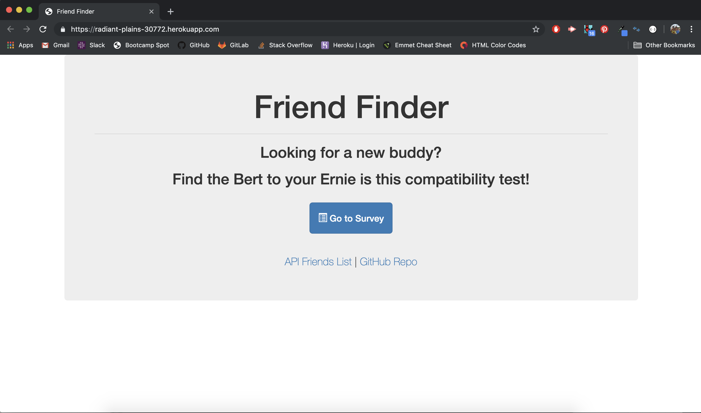
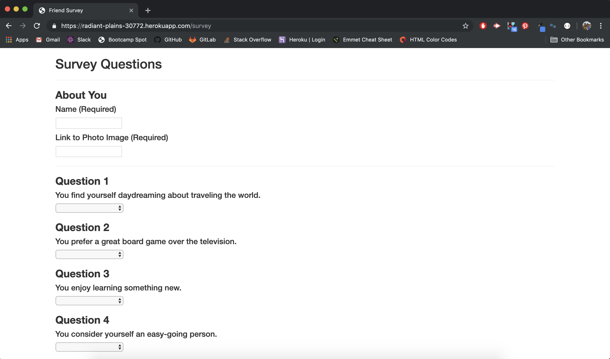

# Friend Finder Survey

## Description

Friend-Finder is a compatibility-based test that matches you with a lucky person in our database! Click on the `Go to Survey` button on the home page to get started.

Once you've navigated to the survey page, fill out your name, an image of yourself, and answer the 10 survey questions. Questions are on a scale of 1-5, with 1 representing Strongly Disagree and 5 representing strongly agree. If any questions of the form are not filled in, you will get an alert to please fill out all possible field of survey.

If you have filled out all questions, a modal will pop up upon submission that matches you to your best possible friend from our database.

## Deployment

Friend-finder is hosted on Heroku: [Heroku application](https://radiant-plains-30772.herokuapp.com/survey)

## Languages and Tools Used

* APIs
* Node.js
* Express
* Path
* Routing
* Bootstrap
* jQuery
* JavaScript
* HTML
